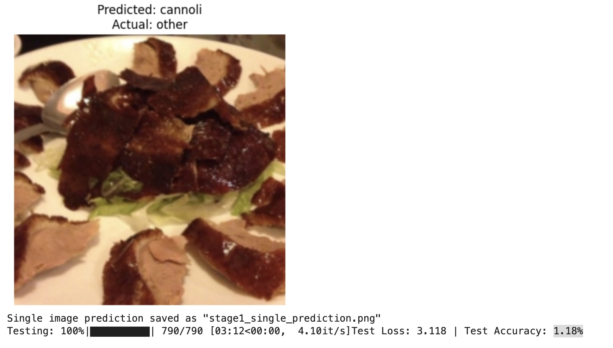
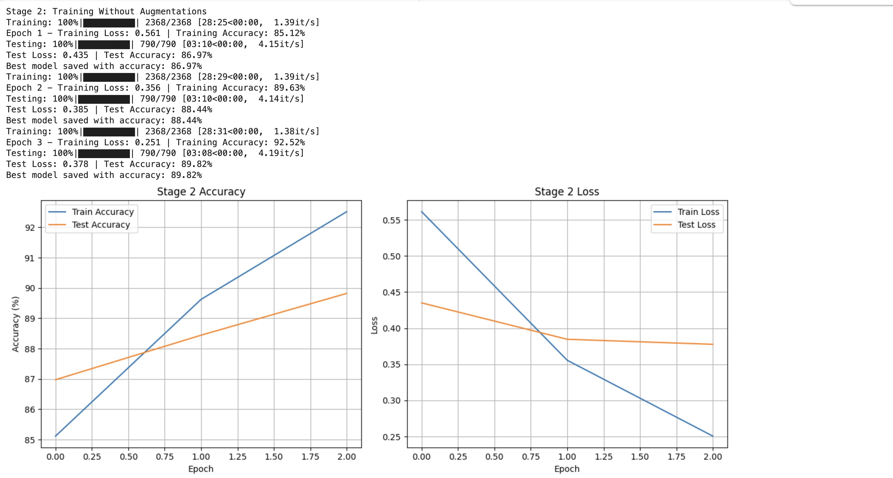
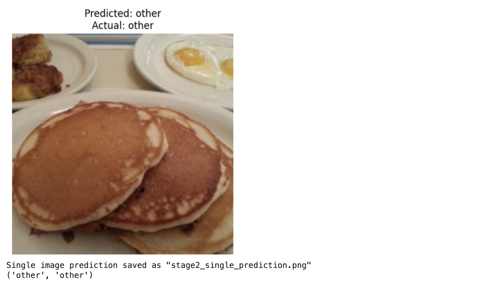

# Food-101 Image Classification using ResNet152

This project demonstrates the progression of training a **ResNet152-based CNN model** on the **Food-101 dataset**, fine-tuned to classify food images into 21 categories (20 specific foods + 'other'). The implementation uses **PyTorch**, runs in **Google Colab with GPU**, and shows performance improvement across three stages:
1. Baseline evaluation without training
2. Basic training without augmentations
3. Optimized training with data augmentation, mixed precision, and learning rate scheduling

**Goal**: To show how image classification models evolve from poor baseline performance to high accuracy through optimization techniques suitable for a college-level computer vision course.

---

## Dataset

**Dataset Used**: [Food-101](https://www.kaggle.com/dansbecker/food-101) from Kaggle  
**Classes Used**: First 20 classes from Food-101 + an additional `'other'` category  
**Total Classes**: 21  
**Image Size**: Resized to 224x224  
**Training Images**: ~75,750  
**Testing Images**: ~25,250  

The dataset is loaded using `kagglehub`, and a custom `Food21` dataset class is used to handle label encoding and preprocessing.

---

## 🔧 Installation Instructions

### 1. Prerequisites
Make sure you have the following installed:
- Python 3.x
- PyTorch 1.13+
- torchvision
- kaggle API (`pip install kaggle`)
- tqdm, matplotlib, numpy, pandas, pillow

### 2. Google Colab Setup
To run this notebook in **Google Colab**:
1. Open the notebook in Google Colab.
2. Make sure **GPU is enabled** (Runtime > Change runtime type > GPU).
3. Install required packages:
   ```bash
   pip install torch torchvision tqdm matplotlib numpy pandas pillow kagglehub
   ```
4. Upload your `kaggle.json` API token when prompted to download the dataset.

---

## Usage Guide

### 1. Download Dataset
Run the following cell at the beginning to download the dataset:
```python
import kagglehub
path = kagglehub.dataset_download("dansbecker/food-101")
print("Path to dataset files:", path)
```

### 2. Run Notebook Cells Sequentially
The notebook is structured in stages:
- **Stage 1**: Evaluate pre-trained model (no training)
- **Stage 2**: Train for 3 epochs without augmentations
- **Stage 3**: Train for 3 epochs with full optimizations (augmentations, mixed precision, scheduler)

Each stage includes:
- Model training (if applicable)
- Evaluation metrics (loss, accuracy)
- Accuracy/loss plots
- Single image prediction visualization

### 3. Save and Load Best Model
At the end of each training stage, the best-performing model is saved as:
- `stage2_best.pt` (Stage 2)
- `stage3_best.pt` (Stage 3)

You can load them later using:
```python
model.load_state_dict(torch.load('stage3_best.pt'))
```

---

### Stage 1: Pre-trained Model Prediction (No Training)

**Test Accuracy Screenshot and Single Prediction:**  


> **Output**: Low test accuracy (~1.2%), showing need for fine-tuning.

---

### Stage 2: After 3 Epochs of Basic Training

**Training/Test Accuracy Plot:**  


**Single Prediction Screenshot:**  


> **Test Accuracy**: ~89%

---

### Stage 3: After Augmentation & Mixed Precision Training

**Training/Test Accuracy Plot:**  


**Single Prediction Screenshot (During Training):**  


**Final Best Model Prediction Screenshot:**  


> **Test Accuracy**: ~89.81%  

---

## 🧠 Key Techniques Used

- **Model Architecture**: ResNet152 (pretrained on ImageNet)
- **Gradient Checkpointing**: Reduces memory usage during training
- **Data Augmentations**:
  - RandomResizedCrop
  - RandomHorizontalFlip
  - CutOut
- **Mixed Precision Training**: Using `torch.cuda.amp`
- **Learning Rate Scheduler**: Cosine Annealing with Linear Warmup

---

## 📚 Dependencies

- `torch`, `torchvision`: For model and dataset handling
- `kagglehub`: For downloading the dataset
- `matplotlib`, `numpy`, `pandas`: For plotting and data manipulation
- `tqdm`: For progress bars
- `PIL`: For image processing

---

## 🏁 Conclusion

This project effectively demonstrates how deep learning models improve with proper fine-tuning, data augmentation, and training strategies. It serves as a comprehensive example for students studying:
- Deep Learning
- Computer Vision
- Transfer Learning
- Optimization Techniques

---

## 📂 File Structure

```
app.ipynb                    # Main notebook
inference_report             # Contains stucture report for the project
readme.md                    # Read before runnning project
screenshots                  # Contains screenshots of development

# After running

stage1_single_prediction.png # Prediction visualization for Stage 1
stage2_single_prediction.png # Prediction visualization for Stage 2
stage2_metrics.png           # Accuracy/Loss plot for Stage 2
stage3_single_prediction.png # Prediction visualization for Stage 3
stage3_metrics.png           # Accuracy/Loss plot for Stage 3
stage2_best.pt               # Best model weights after Stage 2
stage3_best.pt               # Best model weights after Stage 3
```

---

## Feedback / Issues

If you encounter any issues or have suggestions for improvements, feel free to open an issue or reach out!

---